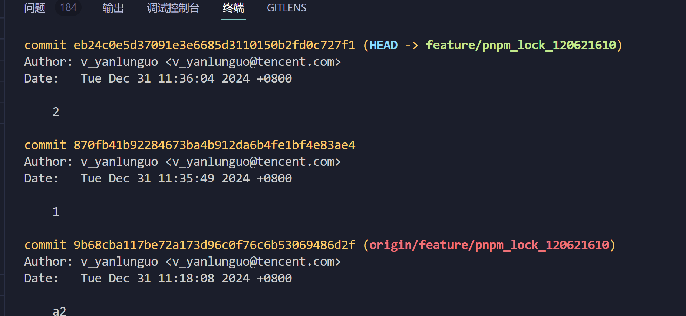
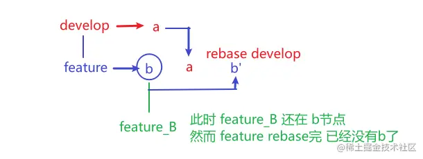

# GIT 面试

## 变基合并 和 压缩合并

P.S.

- 描述方便合并分支用 master 替代,
- 通过 `git log` 查看 commit 日志.
  (下图 commit 后英文是 hashId, 也是 commitId. 在实际使用中，通常不需要完整的 40 个字符，使用前几位就足够了，只要确保它们在特定的仓库中是唯一的。)
  

### 压缩合并

**概念：** 将多次 commit 提交为 1 次合入 master。
**概念图：**

### 变基合并

**概念：** 将在开发分支上所有的 commit 信息合并到 master 上。
**概念图：**

**变基命令：** `git rebase <基础分支> [目标分支]`

1. 当前所属目标分支(feature/xxx)，基于 master 变基: `git rebase master` 若当前不在所属可以 `git rebase master feature/xxx`
2. 若有遇到冲突，解决冲突后使用: `git rebase --continue` 反复，直到冲突解决为止。
3. 最后切换到 master，执行 `git merge feature/xxx` 来合并目标分支。

**变基用法一:** 从上面的概念图，可以看出变基后，会重置我们的提交(C5, C6)，将之前的提交串行在 C4 后面，生成 (C5', C6' hashId 会重新生成，原先的 C5, C6 提交记录被删除, <hashId 是每个 commit 的 id>)

**变基用法二:** 合并当前分支多个 commit 记录， 通过 git rebase -i \<hashId> 。
[具体步骤](https://juejin.cn/post/7035512330662182920#heading-0)

注意事项：

1. 不要对公共分支进行变基。操作后导致下图(图片假设 feature 是公共分支)，变基会重置提交，原先从公共分支拉取的分支，合并操作会有问题。
   

## 暂存

**命令：**
暂存当前更改: `git stash save [注释]`
显示暂存列表: `git stash list`
从暂存中恢复更改: `git stash pop [stash@{id}]` 没写 stashId 则弹出最新暂存
删除暂存: `git stash drop [stash@{id}]` 没写 stashId 则删除最新暂存
删除所有暂存: `git stash clear`

## 回退

回退指定 commit 命令：git reset --hard \<hashId>

## 单独提交一个 commit

默认情况下，`git push` 会推送暂存区所有提交.

我们可以使用该命令来指定推送 commit -> `git push origin [hashId:]<远程分支名>`.
这也会推送 hasId 之前的提交。解释：依次 commit 1,2,3. 执行 `git push origin eb24c0e5(commit 2 的 hashId):<远程分支名>` 会推送 commit 1,2

思路：我们想提交单独一个 commit. 需要将我们目标的 commit 提交到最前面.

1. 执行 `git rebase -i`
2. 光标定位到目标 commit 再输入 `:m0` 将该 commit 移动到最前面，再输入 `:x` 保存。（有冲突的话，和上文变基冲突解决类似）
3. ==注意：== 变基后 hasId 会改变的，需要查看下变基后 hashId (可通过 git rebase -i 查看即可，输入 `:q` 关闭 vim 编辑)
4. `git push origin 变基后的hashId:<远程分支名>`
