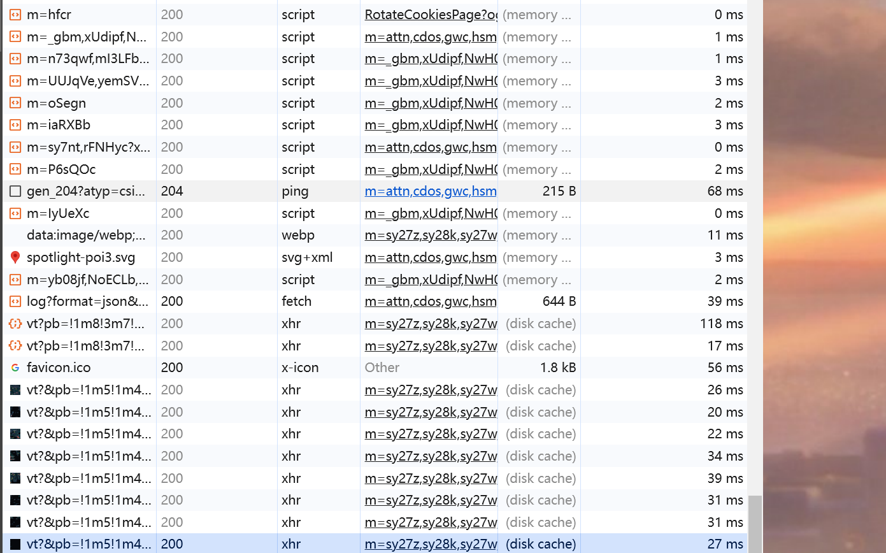

# HTTP 网络

## 跨域问题

一个请求 url 的 <font color=#FF000 >协议、域名、端口</font> 三者之间的任意一个与当前页面 url 不同即为跨域。(三者相同则为 **同源策略**，浏览器有同源策略的限制)

解决方案：

- 前端使用 **whistle** 代理来绕过浏览器这层的限制，如果服务器有限制，whistle 也无法解决跨域问题.
- **JSONP** 利用 script 标签的 src 属性来实现跨域数据交互（不受跨域限制）, 服务器直接返回一段 JS 代码的函数调用，将服务器数据放在函数实参中，前端提前写好响应的函数准备回调，接收数据，实现跨域数据交互。

```js
// 前端处理
<script>
  function callfun(data) {
    document.getElementById('qwerty').innerHTML = data;
  }
</script>
<script src="http://127.0.0.1:10010/js?call=callfun"></script>

// 后端处理
ctx.body = ctx.query.call + '("nihao")';
```

- **CORS**: 主要是在服务端进行操作。
  客户端：发送 http 请求，浏览器会添加 origin 请求头，值为当前发起请求的域名。
  服务端：服务器需要加入 **Access-Control-Allow-Origin** 响应头，指明可以共享数据的域。如：`Access-Control-Allow-Origin: http://localhost`.
  若设置为 `Access-Control-Allow-Origin: *` 则表示可与任意域进行数据共享。
  跨域请求有分两种 ==_简单请求_、_复杂请求_==
  同时满足以下两大条件，就属于简单请求：

  1. 请求方法是以下三种方法之一：HEAD, GET, POST
  2. HTTP 的头信息不超出以下几种字段：

  - Accept
  - Accept-Language
  - Content-Language
  - Last-Event-ID
  - Content-Type：只限于三个值 application/x-www-form-urlencoded、multipart/form-data、text/plain

  刚讲述设置 `Access-Control-Allow-Origin` 可以解决跨域问题，只适用于简单请求。
  复杂请求，浏览器还会先发送 OPTIONS 请求以取得服务器的确认。如：随意添加一个请求头，服务器没有额外的设置 `Access-Control-Allow-Headers` 。浏览器会做跨域拦截，得不到服务器的确认，浏览器不会发出正式请求（真正的请求不会发起到服务器）。

## 浏览器缓存

### 大致流程：

> 发起请求，没有缓存结果则向服务器发起请求；\
> 有缓存结果也未过期，直接读取浏览器缓存（强制缓存生效）；\
> 浏览器有缓存结果但过期，会携带者缓存标识向服务器发起请求。若请求返回 `304` 代表资源未更新，会再读取浏览器缓存（协商缓存生效）。若请求返回 `200` 代表资源更新了，读取服务器资源，且将请求结果存入浏览器缓存中。
> 过程图如下：
> 

详细讲一下两个缓存策略

### 强制缓存

**概念：** 强制缓存就是向浏览器缓存查找该请求结果，并根据该结果的缓存规则来决定是否使用该缓存结果的过程。

强制缓存有三种情况：

- 不存在缓存标识和结果，强制缓存失效，向服务器发起请求。
- 存在缓存标识和结果，但该结果失效，强制缓存失效，则使用协商缓存（下文分析）。
- 存在缓存标识和结果，且未失效，强制缓存生效。

**强制缓存的缓存规则：**\
浏览器发起请求，服务器会将缓存规则放在 HTTP 响应头的 HTTP 头中，并与请求结果一起返回给浏览器。\
控制强制缓存的字段分别是 Expires 和 Cache-Control，其中 Cache-Control 优先级比 Expires 高。


- Expires: 其值为服务器返回该请求结果缓存的到期时间，即再次发起该请求时，如果客户端的时间小于 Expires 的值时，直接使用缓存结果。
- Cache-Control: Expires 存储的绝对时间会因为时区问题，导致强制缓存失去意义。存储的是相对时间 `max-age=xxx ` 缓存内容将在 xxx 秒后失效。[Cache-Control 指令](https://developer.mozilla.org/zh-CN/docs/Web/HTTP/Headers/Cache-Control#%E6%8C%87%E4%BB%A4)

> **拓展：**\
>
> 1. _浏览器的缓存存放在哪里？_\
>     
>    状态码为灰色的请求则代表使用了强制缓存，请求对应的 Size 值则代表该缓存存放的位置，分别为 `from memory cache 和 from disk cache`。\
>     `from memory cache` 代表使用内存中的缓存，`from disk cache` 则代表使用的是硬盘中的缓存，浏览器读取缓存的顺序为 **memory –> disk**。\
>    在浏览器中，浏览器会在 _js 和图片等文件_ 解析执行后直接存入内存缓存中，那么当刷新页面时只需直接从内存缓存中读取(from memory cache)；而 _css 文件_ 则会存入硬盘文件中，所以每次渲染页面都需要从硬盘读取缓存(from disk cache)。

### 协商缓存

**概念：** 协商缓存就是强制缓存失效后，浏览器携带缓存标识向服务器发起请求，由服务器根据缓存标识决定是否使用缓存的过程。
协商缓存有两种情况：

- 协商缓存生效，返回 304。
- 协商缓存失效，返回 200 和请求结果。

**协商缓存的缓存规则：**\

Etag / If-None-Match 优先级高于 Last-Modified / If-Modified-Since，同时存在则只有 Etag / If-None-Match 生效。


- **Last-Modified / If-Modified-Since:** \
  `Last-Modified` 是服务器响应请求时，返回该资源文件在服务器最后被修改的时间。 \
  `If-Modified-Since` 则是客户端再次发起该请求时，携带上次请求返回的 Last-Modified 值。服务器收到该请求，用请求头中的 `If-Modified-Since` 的时间和资源在服务器最后修改时间做对比，小于则返回 304（使用缓存资源），大于返回 200（重新获取资源）.

- **Etag / If-None-Match:** \
  `Etag` 是服务器响应请求时，返回当前资源文件的一个唯一标识（由服务器生成） \
  `If-None-Match` 是客户端再次发起该请求时，携带上次请求返回的唯一标识 Etag 值。发起请求做对比，相同返回 304，不同返回 200
