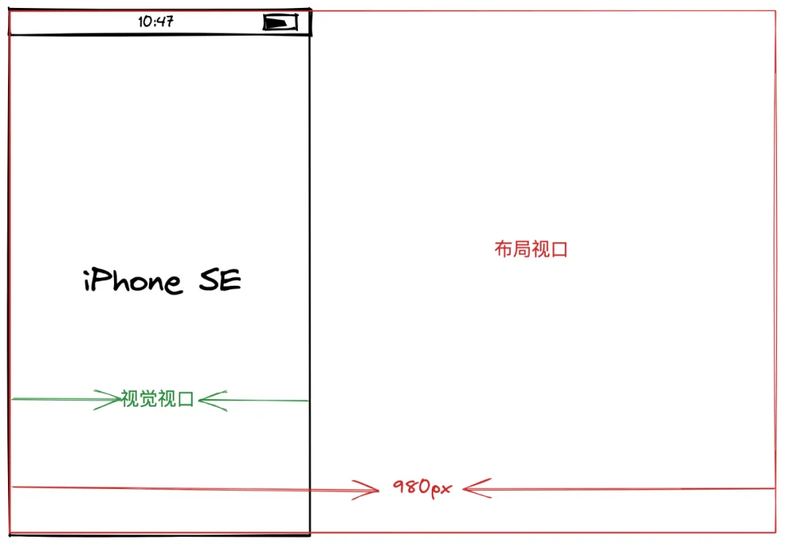

# 方案 面试题

## 移动端适配方案

### 屏幕分辨率

- 物理像素（设备像素）：固定的, 设备出厂决定像素点个数，不同设备物理像素点的大小是不一样的。
- 逻辑像素（设备独立像素）：就是 css 设置的像素。dpr 为 1，设备独立像素与物理像素相等；dpr 为 2，把 4 个物理像素当 1 个逻辑像素使用。retina 屏 dpr 等于 2 或更高。
- 设备像素比（dpr）: 设备像素比(dpr) = 物理像素/设备独立像素。iphone6 dpr 为 2，一个设备独立像素便为 4 个物理像素。\
  css 设置 1px 在屏幕上占据 4 个物理像素。在 retina 屏会有常说的 1px 问题："1px 显得更粗".

### 视口概念


当页面缩放比例为 100%时，理想视口 = 视觉视口。

```html
<!-- 初始化 html 我们通常在 head 中会看到这段代码 -->
<meta name="viewport" content="width=device-width, initial-scale=1.0" />
<!-- 
 在 PC 端不设置这行代码没影响。
 但在移动端中不设置会让布局视口为 980px。
 「width=device-width」这部分代码的作用是将网页的宽度设置为设备屏幕的宽度。
 「initial-scale=1」表示不进行缩放，视窗刚好等于理想视窗
 -->
```

### **1px 解决方案:**

- 设置 viewport 的 initial-scale。对于 dpr=2 的屏幕，1px 压缩一半便可与 1px 的设备像素比匹配，这就可以通过将缩放比 initial-scale 设置为 0.5=1/2 而实现。
- 创建伪元素 + transform: scale(0.5) 也可以实现

移动端适配方案：

- rem 适配
  监听页面 resize 事件，改变根元素 font-size 大小，元素使用 rem 单位设置大小。\
  团队项目 H5 项目也是用该方式适配。

  [rem 适配方案](./demo/rem适配方案.html)

- 视口单位适配
  使用 vw, vh 单位
