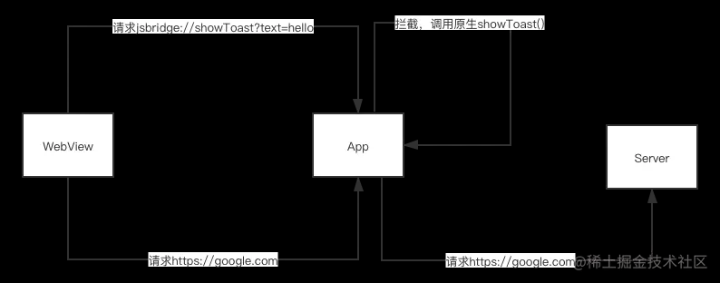

# 方案 面试题

## 移动端适配方案

### 屏幕分辨率

- 物理像素（设备像素）：固定的, 设备出厂决定像素点个数，不同设备物理像素点的大小是不一样的。
- 逻辑像素（设备独立像素）：就是 css 设置的像素。dpr 为 1，设备独立像素与物理像素相等；dpr 为 2，把 4 个物理像素当 1 个逻辑像素使用。retina 屏 dpr 等于 2 或更高。
- 设备像素比（dpr）: 设备像素比(dpr) = 物理像素/设备独立像素。iphone6 dpr 为 2，一个设备独立像素便为 4 个物理像素。\
  css 设置 1px 在屏幕上占据 4 个物理像素。在 retina 屏会有常说的 1px 问题："1px 显得更粗".

### 视口概念


当页面缩放比例为 100%时，理想视口 = 视觉视口。

```html
<!-- 初始化 html 我们通常在 head 中会看到这段代码 -->
<meta name="viewport" content="width=device-width, initial-scale=1.0" />
<!-- 
 在 PC 端不设置这行代码没影响。
 但在移动端中不设置会让布局视口为 980px。
 「width=device-width」这部分代码的作用是将网页的宽度设置为设备屏幕的宽度。
 「initial-scale=1」表示不进行缩放，视窗刚好等于理想视窗
 -->
```

### **1px 解决方案:**

- 设置 viewport 的 initial-scale。对于 dpr=2 的屏幕，1px 压缩一半便可与 1px 的设备像素比匹配，这就可以通过将缩放比 initial-scale 设置为 0.5=1/2 而实现。
- 创建伪元素 + transform: scale(0.5) 也可以实现

移动端适配方案：

- rem 适配
  监听页面 resize 事件，改变根元素 font-size 大小，元素使用 rem 单位设置大小。\
  团队项目 H5 项目也是用该方式适配。

  [rem 适配方案](./demo/rem适配方案.html)

- 视口单位适配
  使用 vw, vh 单位

## 拖拽实现

### 非 H5 方案

[非 H5 实现拖拽](./demo/手写拖拽实现.html)

### H5 方案

[H5 实现拖拽](./demo/H5实现拖拽.html)

## JSBridge 浅谈

**用途：** 实现 H5 和 Native 之间的双向通信。

> webView 是移动端提供的运行 JavaScript 的环境，是系统渲染 Web 网页的一个控件。

### Native 调用 Web

将拼接好的 js 代码字符串传入，Native 端的 js 解析器(webView)执行。

```java
String jsCode = String.format("window.showWebDialog('%s')", text);
webView.evaluateJavascript(jsCode, new ValueCallback<String>() {
  @Override
  public void onReceiveValue(String value) {

  }
});

```

### Web 调用 Native

有两种方式调用:

#### 1. 拦截 Webview 请求的 URL Schema

实现：Web 端 发送的所有请求都会经过 WebView 组件，Native 对符合我们自定义的 URL Schema 进行拦截。

我们常使用在 web 端使用 **iframe** 发起请求，Native 来进行拦截的方案。

URL Schema 格式如下：`<protocol>://<host>/<path>?<qeury>#fragment`\
 例: `jsbridge://showToast?text=hello`

```js
/**
 * 创建 iframe 请求
 * @param url iframe url
 * @param removeAfterSend 发送请求后是否删除，默认为 true
 */
export function createIframeRequest(url: string, removeAfterSend = true) {
  const proxyFrame = document.createElement('iframe');
  proxyFrame.style.cssText = 'width:0;height:0;border:none;position:fixed;top:0;left:0;';
  // 使可能存在的 html2canvas 忽略这个 iframe
  proxyFrame.setAttribute('data-html2canvas-ignore', 'true');
  proxyFrame.src = url;
  document.body.appendChild(proxyFrame);
  if (removeAfterSend) {
    window.setTimeout(() => {
      proxyFrame?.parentNode?.removeChild?.(proxyFrame);
    }, 300); // 设置 300 ms 的延迟，防止终端未拦截到请求
  }

  return proxyFrame;
}
```

#### 2. 向 Webview 中注入 JS API

实现：App 将 Native 的相关接口注入到 JS 的 Context（window）的对象中。Web 端在全局对象（window）中使用这个注入的对象。

```java
// Android（4.2+）提供了addJavascriptInterface注入：
// 注入全局JS对象
webView.addJavascriptInterface(new NativeBridge(this), "NativeBridge");

class NativeBridge {
  private Context ctx;
  NativeBridge(Context ctx) {
    this.ctx = ctx;
  }

  // 增加JS调用接口
  @JavascriptInterface
  public void showNativeDialog(String text) {
    new AlertDialog.Builder(ctx).setMessage(text).create().show();
  }
}
```

```js
// web 端直接调用
window.NativeBridge.showNativeDialog('hello');
```

### 带回调的调用

上文只看出单向调用。web 端角度：调用 Native 方法，Native 相关操作无法将结果返回 Web 端。我们需要操作结果返回，也就是 js 回调。

> js 回调实现原理：在一端调用时在 Url Schema 定义 callbackId 或者参数传一个 callbackId 标记对应的回调，对端接收到调用请求后，进行实际操作，如果带有 callbackId，对端再进行一次调用，将结果、callbackId 回传，这端根据 callbackId 匹配相应的回调，将结果传入执行就可以了。

**我接触项目内实现 js 回调**\

- [] 写一个 demo 来理解。

使用的是 拦截 URL Schema 调用，在协议上定义 callbackId。 \

```js
// URL Schema 协议
`jsb://${name}/${callbackId}${CALLBACK_PREFIX}${callbackId}?${stringifyQuery(params)}`;
// name 是调用 Native 中的 方法名。
// callbackId 是回调 id，通常是数字，每次调用都会 +1。
// CALLBACK_PREFIX 是客户端回调函数的前缀，为了全局调用区分。
// params 调用参数


// Web 用 iframe 发送上面这段 URL Schema 请求，同时在全局注册返回值为参数的回调函数。如：
// CALLBACK_ID 全局存储 callbackId 的值。
(globalThis as any)[`${CALLBACK_PREFIX}${globalThis[`${CALLBACK_ID}`]}`] = (resp) => {
  ...;
  resolve(); // Promise 在 web 端调用 Native 方法中
};

// 然后就是 Native 那端根据注入全局的回调函数（上面这段注入的）来执行，操作过程为上文 [Native 调用 Web] 的部分。

```
